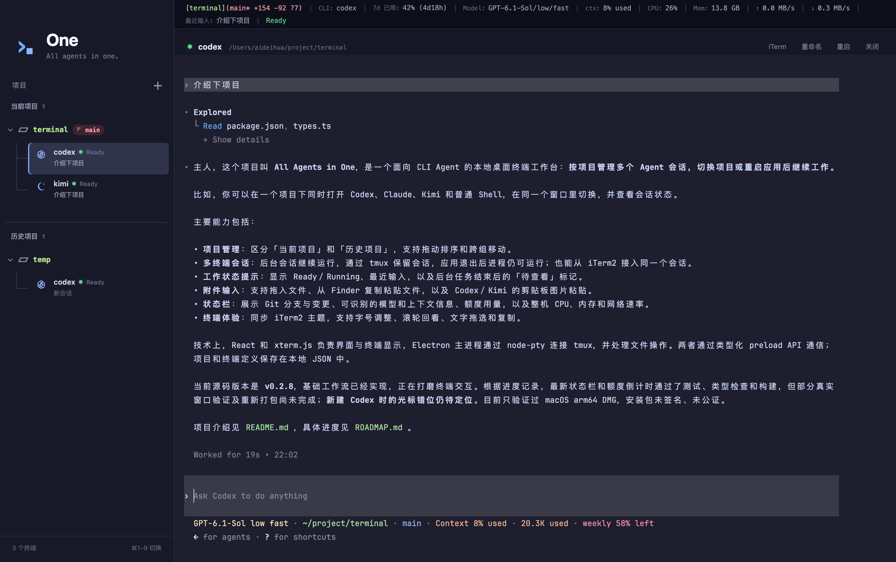

# All Agents in One

## 中文

All Agents in One 是一个本地桌面工作台，用项目组织 CLI Agent 会话。项目使用 Electron、React、xterm.js、node-pty 和 tmux。



### 功能

- 将项目分为「当前项目」和「历史项目」，支持拖动排序及跨组移动。
- 每个项目运行多个终端会话，切换时后台会话继续运行；通过 tmux 在应用重启后恢复，也可在 iTerm2 中接入同一会话。
- 显示 Ready／Running 状态和最近输入；后台会话完成后，用户尚未查看时显示「待查看」标记。
- 状态栏显示项目、Git 分支与变更统计、CLI、可识别的模型配置和上下文、额度及重置倒计时；有数据时显示累计 Token 和花费。无法识别的字段自动隐藏。
- Model 配置统一用 `/` 分隔，例如 `gpt-6.1-sol/low/fast`、`kimi-code/k3/high/auto`，保留模型名大小写。Kimi 原生 thinking 指示器显示为 `/thinking:on` 或 `/thinking:off`，缺失时不推断。
- 显示整台 Mac 的 CPU、估算已用内存和上传／下载速率，约每 3 秒刷新；不可用的指标自动隐藏，状态栏空间不足时换行。
- 支持终端文字拖选与 ⌘C 复制，终端主题自动同步 iTerm2 默认 Profile。
- 在 Codex 或 Kimi 终端中按 ⌘V 粘贴剪贴板图片；CLI 会缓存图片并在输入框显示图片占位标记（需所选模型支持图片输入）。
- 用 ⌘+、⌘− 或在终端区域双指捏合调整字号，⌘0 恢复 iTerm2 配置的字号（未配置时为 14 点）。
- 将本地文件拖入终端可插入路径，支持多文件，不自动回车。项目外文件会复制到当前项目 `.aao/attachments/` 的独立批次目录，并自动添加 Git 忽略；项目内文件直接引用。附件副本保留到手动清理，不与原文件同步，暂不支持文件夹。
- 支持在 Finder 选中文件后按 ⌘C，再到终端按 ⌘V，使用与拖入相同的文件导入流程；复制图片文件也按文件导入，截图和普通文字保留原有粘贴行为。

Git 变更统计显示未提交标记、相对 HEAD 的新增／删除行数和未跟踪文件数，不计未跟踪文件内容或二进制行数。额度从 Kimi HTTPS 接口或 Codex 本地快照获取，显示已用比例；重置时间可用时持续倒计时。内存为估算已用量，网络速率按非回环接口合计。

### 环境要求

- macOS。目前只验证过 arm64 DMG 打包。
- Node.js 22.13 或更新版本，用于开发和运行测试。
- tmux：`brew install tmux`。
- iTerm2 为可选项，仅用于在外部终端接入会话。

### 开发

```bash
npm ci
npm run dev
```

运行检查并构建本地 DMG：

```bash
npm test
npm run typecheck
npm run build
npm run dist
```

`npm run dist` 会将 DMG 输出到 `release/<版本号>/`。当前 macOS 安装包未签名、未公证，首次打开时 Gatekeeper 可能显示提示。

### 数据与隐私

应用不包含通用遥测。项目和终端定义以 `workspace.json` 保存在 Electron 用户数据目录中，其中包括项目路径、终端元数据，以及最多 160 个字符的最近终端输入，用于侧栏标签展示。

Codex 用量信息从本机 `~/.codex/sessions/` 下的近期文件读取。Kimi 用量信息通过为 Kimi Code 配置的 HTTPS `/usages` 接口或 Kimi 默认接口获取。应用读取已有的本地 Kimi access token 发起请求，不会刷新或另行保存该 token。非 HTTPS 的自定义 Kimi 接口会被忽略。

终端命令和会话内容保留在本机；用户在终端中运行的命令或 CLI 工具可能自行发起网络请求。

### 发布产物

当前版本为 **v0.2.9**，本地 arm64 DMG 位于 `release/0.2.9/All Agents in One-0.2.9-arm64.dmg`。目前只打包 DMG；安装包未签名、未公证。

## English

All Agents in One is a local desktop workspace for organizing CLI agent sessions by project. It uses Electron, React, xterm.js, node-pty and tmux.

## Features

- Organize projects into 「当前项目」 and 「历史项目」, with drag and drop to reorder or move between groups.
- Run multiple terminal sessions per project while background sessions continue running. Restore sessions through tmux across application restarts, or attach to the same session in iTerm2.
- Display Ready/Running states and recent input, with a low-key 「待查看」 marker for completed background sessions you have not viewed.
- The status bar shows the project, Git branch and changes, CLI, recognizable model settings and context, quotas and reset countdowns. Total tokens and cost appear when available; unrecognized fields are hidden.
- Model uses `/` to separate recognized settings, such as `gpt-6.1-sol/low/fast` and `kimi-code/k3/high/auto`, preserving model-name casing. Kimi's native thinking indicators appear as `/thinking:on` or `/thinking:off`; missing modes are not inferred.
- Show whole-Mac CPU, estimated used memory, and upload/download rates, refreshed about every 3 seconds. Unavailable metrics are hidden, and the status bar wraps when space is limited.
- Select terminal text by dragging and copy with ⌘C. The terminal theme follows the default iTerm2 profile.
- Press ⌘V in a Codex or Kimi terminal to paste a clipboard image; the CLI caches it and shows an image placeholder (the selected model must support image input).
- Drop local files into a terminal to insert quoted paths without submitting. External files are copied into batch folders under the project's `.aao/attachments/`, which is automatically added to `.gitignore`; internal files are referenced directly. Copies persist until manually removed and do not sync with originals. Multiple files are supported; folders are not.
- Copy files in Finder with ⌘C and paste into a terminal with ⌘V to use the same import flow. Copied image files are imported as files; screenshots and plain text keep their existing paste behavior.
- Use ⌘+, ⌘−, or a two-finger pinch over the terminal to change its font size, and ⌘0 to restore the iTerm2 profile size (14 pt when unavailable).

Git statistics show dirty state, added/deleted lines relative to HEAD, and untracked file counts, excluding untracked contents and binary line counts. Quotas come from the Kimi HTTPS endpoint or local Codex snapshots and show used percentages, with continuously updated reset countdowns when timestamps are available. Memory is an estimate of used memory; network rates aggregate non-loopback interfaces.

## Requirements

- macOS. The arm64 DMG is the only architecture verified for packaging so far.
- Node.js 22.13 or newer for development and tests.
- tmux (`brew install tmux`).
- iTerm2 is optional and only needed for the external attach action.

## Development

```bash
npm ci
npm run dev
```

Run checks and create a local DMG:

```bash
npm test
npm run typecheck
npm run build
npm run dist
```

`npm run dist` writes a DMG to `release/<version>/`. The current macOS build is unsigned and not notarized, so Gatekeeper may warn when opening it.

## Data and privacy

The application has no general telemetry. Project and terminal definitions are stored locally in Electron's user data directory as `workspace.json`. This includes selected project paths, terminal metadata, and up to 160 characters of recent submitted terminal input used for the sidebar label.

Codex usage information is read locally from recent files under `~/.codex/sessions/`. Kimi usage information is fetched from the HTTPS `/usages` endpoint configured for Kimi Code, or the default Kimi endpoint. The app reads the existing local Kimi access token to make that request; it does not refresh or persist the token. Custom non-HTTPS Kimi endpoints are ignored.

Terminal commands and session contents remain on the local machine, except for network requests initiated by commands or CLI tools that the user runs inside those terminals.

## Release artifacts

The current version is **v0.2.9**. The local arm64 DMG is at `release/0.2.9/All Agents in One-0.2.9-arm64.dmg`. Packaging targets DMG only; the artifact is unsigned and not notarized.
